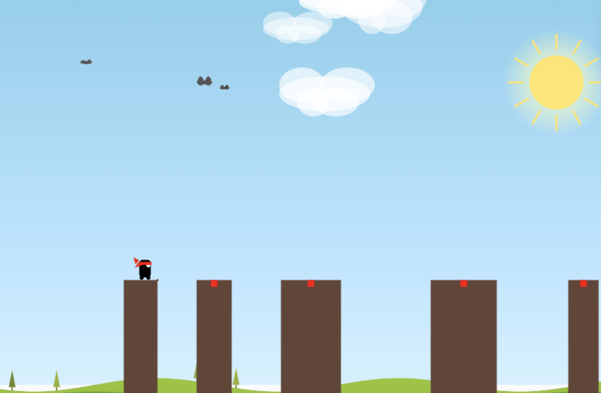

# Stick Hero Game - Next.js

A fun and engaging stick hero game built with Next.js, TypeScript, and modern React patterns.

🚀 [**Play the Live Game**](https://stick-game-zeta.vercel.app/)

## 🎮 Features

- **Smooth Canvas Animation**: 60fps game loop with optimized rendering
- **Responsive Design**: Works on desktop and mobile devices
- **Progressive Scoring**: Perfect hits give double points
- **Statistics Tracking**: Game stats with localStorage persistence
- **Beautiful UI**: Modern design with smooth animations
- **Touch Support**: Full mobile touch controls

## 🎯 How to Play

1. **Start**: Hold down the mouse/touch to stretch out a stick
2. **Release**: Let go to drop the stick and walk across
3. **Perfect Hits**: Land in the red center area for double points
4. **Scoring**: Regular hits = 1 point, Perfect hits = 2 points
5. **Goal**: Achieve the highest score possible!

### Code Organization

- **Components**: Reusable UI components with props interfaces
- **Hooks**: Custom hooks for state management and side effects
- **Types**: Centralized TypeScript type definitions
- **Utils**: Pure functions for game logic and canvas operations
- **Constants**: Configuration values and game parameters
